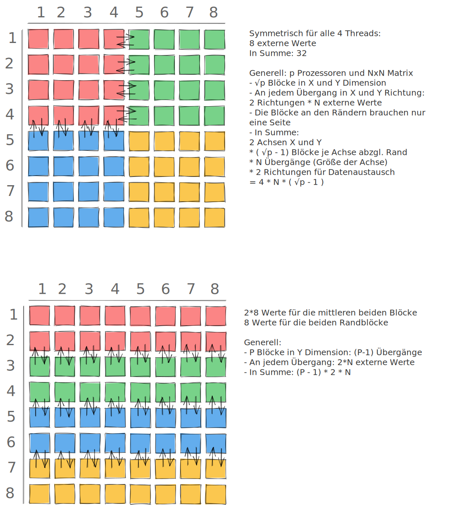

# Arbeitsaufteilung

## Frage: 

Wie können Sie eine n x n-Matrix optimal auf p Prozessoren aufteilen unter folgenden Bedingungen:
- Stencil-Operation, die die 4 direkt benachbarten Elemente der Matrix zur Berechnung des neuen Werts verwendet (links, rechts, oben, unten - nicht diagonal)
- Kein "Wrap-Over", d.h. das erste Element ("links-oben") verwendet nur 2 Nachbarn
- Nur Read-Operationen von Elementen, die zu einem anderen Prozessor gehören

Berechnen Sie die Anzahl der benötigten Operationen
- als absolute Zahl für n = 8 und p = 4 und 
- als allgemeine Formel von n und p

für

- Ihre optimale Aufteilung
- die Aufteilung in p Zeilen

## Antwort:

Optimal ist eine Aufteilung, die Blocks bildet mit möglichst wenigen Randelementen. Das sind in diesem Fall Quadrate, z.B. bei n = 8 und p = 4:

Als Größenordnung:
- n = 1024, p = 16:
  - Quadrate: 6.144
  - Zeilen: 30.720
  - Verhältnis: 5x
